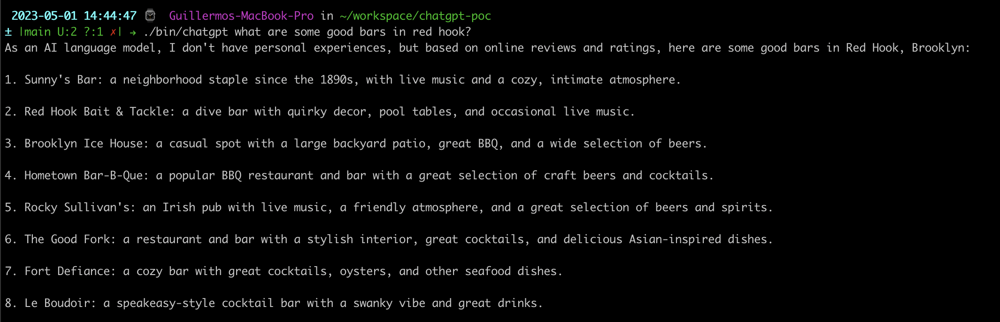

# ChatGPT CLI

This project is a Proof of Concept (POC) that demonstrates how to build ChatGPT clients with streaming support in a
Command-Line Interface (CLI) environment.



## Development

To start developing, set the `OPENAI_API_KEY` environment variable to
your [ChatGPT secret key](https://platform.openai.com/account/api-keys). Follow these steps for running tests and
building the application:

1. Run the unit tests using the following script:

```shell
./scripts/unit.sh
```

2. Build the app using the installation script:

```shell
./scripts/install.sh
```

3. After a successful build, test the application with the following command:

```shell
./bin/chatgpt what type of dog is a Jack Russel?
```

For more options see:
```shell
./bin/chatgpt --help
```

## Links

* [ChatGPT API Documentation](https://platform.openai.com/docs/introduction/overview)
* [Key Usage Dashboard](https://platform.openai.com/account/usage)